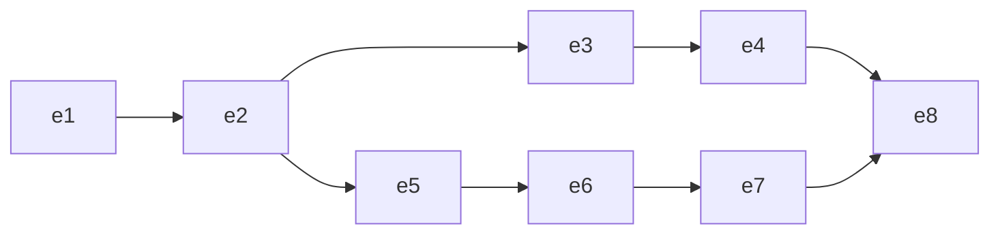
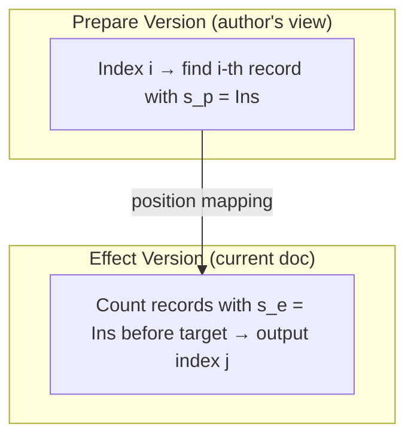

+++
title = "Advance and Retreat Mechanism"
description = "How eg-walker navigates the causal graph by advancing and retreating individual events to simulate each operation's original context."
weight = 3
tags = ["distributed-systems", "algorithms", "visualization"]
latex = "V_p \\xrightarrow{\\text{retreat}(e)} V_p \\setminus \\{e\\} \\xrightarrow{\\text{advance}(e')} V_p \\cup \\{e'\\}"
prerequisites = ["eg-walker-overview"]
+++

## Statement

The eg-walker processes events in topological order but must interpret each event's operation in the **context of its parents** — not the current state. The advance/retreat mechanism solves this by maintaining two simultaneous views of the document:

- **Prepare version** $V_p$: can move forward (advance) and backward (retreat)
- **Effect version** $V_e$: only moves forward (via apply)

Before applying event $e$, the algorithm adjusts $V_p$ to match $\text{Events}(e.\text{parents})$:

$$V_p \xrightarrow{\text{retreat}(e_1), \ldots, \text{retreat}(e_k)} V_p' \xrightarrow{\text{advance}(e'_1), \ldots, \text{advance}(e'_j)} \text{Events}(e.\text{parents})$$

## The Three Operations

### Apply$(e)$

**Precondition**: $V_p = \text{Events}(e.\text{parents})$ and $e \notin V_e$.

**Effect**: Updates both versions: $V_p \leftarrow V_p \cup \{e\}$, $V_e \leftarrow V_e \cup \{e\}$.

**Output**: The transformed operation — how the document at $V_e$ changes.

### Retreat$(e)$

**Precondition**: $e \in V_p$.

**Effect**: $V_p \leftarrow V_p \setminus \{e\}$. The effect version $V_e$ is **unchanged**.

Makes the prepare version behave as if $e$ had not yet happened.

### Advance$(e)$

**Precondition**: $e \notin V_p$ but $e \in V_e$.

**Effect**: $V_p \leftarrow V_p \cup \{e\}$. The effect version $V_e$ is **unchanged**.

Restores a previously retreated event to the prepare version without re-applying it.

## Visualization

Processing events $e_1, \ldots, e_8$ in topological order with the causal structure shown:

The algorithm proceeds:

| Step | Action | $V_p$ after | $V_e$ after |
|------|--------|-------------|-------------|
| 1 | apply($e_1$) | $\{e_1\}$ | $\{e_1\}$ |
| 2 | apply($e_2$) | $\{e_1, e_2\}$ | $\{e_1, e_2\}$ |
| 3 | apply($e_3$) | $\{e_1, e_2, e_3\}$ | $\{e_1, e_2, e_3\}$ |
| 4 | apply($e_4$) | $\{e_1, \ldots, e_4\}$ | $\{e_1, \ldots, e_4\}$ |
| 5 | retreat($e_4$), retreat($e_3$) | $\{e_1, e_2\}$ | $\{e_1, \ldots, e_4\}$ |
| 6 | apply($e_5$) | $\{e_1, e_2, e_5\}$ | $\{e_1, \ldots, e_5\}$ |
| 7 | apply($e_6$) | $\{e_1, e_2, e_5, e_6\}$ | $\{e_1, \ldots, e_6\}$ |
| 8 | apply($e_7$) | $\{e_1, e_2, e_5, e_6, e_7\}$ | $\{e_1, \ldots, e_7\}$ |
| 9 | advance($e_3$), advance($e_4$) | $\{e_1, \ldots, e_7\}$ | $\{e_1, \ldots, e_7\}$ |
| 10 | apply($e_8$) | $\{e_1, \ldots, e_8\}$ | $\{e_1, \ldots, e_8\}$ |

Note step 9: we advance $e_3, e_4$ **without retreating** $e_5, e_6, e_7$ — concurrent events coexist in the prepare version when the target event ($e_8$) has both branches as parents.

## Computing the Retreat/Advance Sets

Given old prepare version $G_{\text{old}}$ and target $G_{\text{new}} = \text{Events}(e.\text{parents})$:

$$\text{Retreat set} = G_{\text{old}} \setminus G_{\text{new}} \quad \text{(processed in reverse topological order)}$$
$$\text{Advance set} = G_{\text{new}} \setminus G_{\text{old}} \quad \text{(processed in topological order)}$$

Efficient computation uses a **priority queue** traversal:

1. Insert frontier events of both $G_{\text{old}}$ and $G_{\text{new}}$ into a max-priority-queue (ordered by topological position)
2. Pop the maximum element; tag it as "retreat" (from $G_{\text{old}}$ only) or "advance" (from $G_{\text{new}}$ only)
3. If popped from both — it's a common ancestor; enqueue its parents
4. Stop when all remaining elements are common ancestors

## Index Transformation

The two-version state enables index transformation:

1. **Locate**: Use the prepare version ($s_p = \text{Ins}$ count) to find the $i$-th visible character — this is where the operation's author saw the character
2. **Map**: Translate that record's position to the effect version ($s_e = \text{Ins}$ count) — this gives the correct index in the current document

If the target record has $s_e = \text{Del}$, the deletion is a **no-op** (the character was already deleted by a concurrent operation).

## Connections

The retreat/advance mechanism maintains the [[Internal State Machine]] invariants. Correctness of the overall algorithm (the [[Event Graph Convergence Proof]]) depends on retreat and advance being exact inverses for the prepare version. The [[Eg-walker: Event Graph Walker]] overview provides the broader algorithmic context.
