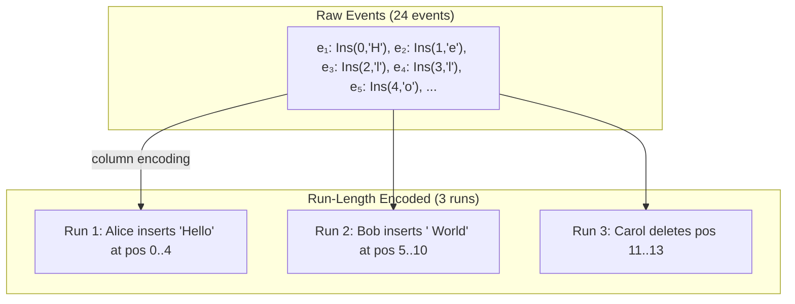

+++
title = "Compact Event Graph Encoding"
description = "Column-oriented, run-length encoded storage format that compresses collaborative editing histories by orders of magnitude."
weight = 6
tags = ["distributed-systems", "data-structures", "optimization"]
latex = "\\text{size}(G) = O(|E| \\cdot \\text{avg\\_run}^{-1})"
prerequisites = ["eg-walker-overview"]
+++

## Statement

The eg-walker stores the event graph in a **column-oriented, run-length encoded** format that exploits the sequential nature of typical text editing. Events are topologically sorted and grouped into runs of consecutive operations from the same replica.

## Encoding Scheme

Events are decomposed into columns, each compressed independently:

| Column | Content | Compression |
|--------|---------|-------------|
| **Operation type + start position** | Ins/Del + index | Run-length: consecutive inserts at adjacent positions collapse |
| **Inserted content** | UTF-8 characters | LZ4 compression of concatenated text |
| **Parents** | Causal predecessor IDs | Default = predecessor in sort; only exceptions stored |
| **Event IDs** | (replica, seq) pairs | Runs of consecutive sequence numbers from same replica |

## Visualization

A typical editing session with three users:

## Parent Encoding

The key insight for parent compression: in a topological sort, most events' parent is simply the immediately preceding event. Only branch points and merge points need explicit parent storage.

$$\text{Parent}(e_i) = \begin{cases} e_{i-1} & \text{(default — stored implicitly)} \\ \text{explicit IDs} & \text{(branch/merge points only)} \end{cases}$$

For a document with $n$ events and $b$ branch/merge points, parent storage is $O(b)$ rather than $O(n)$.

## Space Complexity

| Scenario | Events | Compressed size | Ratio |
|----------|--------|----------------|-------|
| Single user, sequential typing | $n$ | $O(n / \text{avg\_run\_length})$ | ~10–50× reduction |
| Real-time collaboration (2–5 users) | $n$ | $O(n \cdot c)$ where $c \ll 1$ | ~5–20× reduction |
| Worst case (random interleaving) | $n$ | $O(n)$ | No compression benefit |

## Comparison with CRDT Storage

Traditional CRDTs (Yjs, Automerge) store per-character metadata **in the document state**:

$$\text{CRDT memory} = |D| \cdot (\text{ID size} + \text{tombstone overhead} + \text{ordering metadata})$$

Eg-walker stores metadata **in the event history** and keeps only the document string in steady state:

$$\text{Eg-walker memory} = |D| + |\text{event log (compressed)}|$$

The event log can be stored on disk and only the portion after the last critical version needs to be in memory for processing new events.

## Connections

The compact encoding makes the [[Eg-walker: Event Graph Walker]] practical for real-world use. [[Critical Versions and Partial Replay]] enables discarding old portions of the encoded history. The encoding is orthogonal to the [[Internal State Machine]] — it affects storage, not processing semantics.
