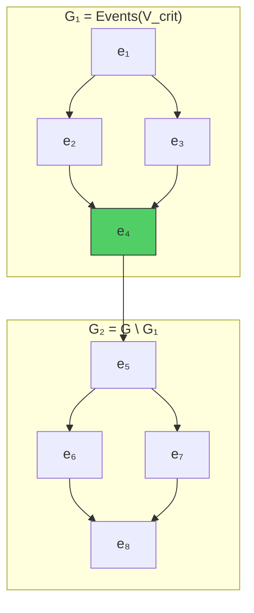
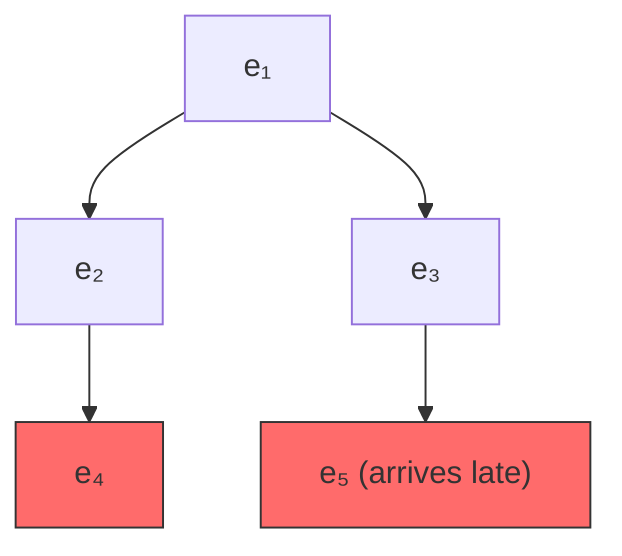

+++
title = "Critical Versions and Partial Replay"
description = "How critical versions partition the event graph into independently processable sections, enabling garbage collection and efficient state reconstruction."
weight = 5
tags = ["distributed-systems", "optimization", "visualization"]
latex = "\\forall e_1 \\in G_1,\\; \\forall e_2 \\in G_2: \\quad e_1 \\rightarrow e_2"
prerequisites = ["event-graph-convergence"]
+++

## Statement

**Definition (Critical Version).** A version $V$ of event graph $G$ is **critical** iff it partitions $G$ into $G_1 = \text{Events}(V)$ and $G_2 = G \setminus G_1$ such that:

$$\forall\, e_1 \in G_1,\; \forall\, e_2 \in G_2: \quad e_1 \rightarrow e_2$$

Equivalently: every event in $G$ either happened at or before $V$, or happened strictly after **all** events in $V$. There are no events concurrent with any event in $V$ that also have descendants in $G_2$.

**Theorem (Partition Independence).** Events before a critical version do not affect how events after the critical version are transformed. The internal state can be discarded and rebuilt from a critical version without changing the output.

## Visualization

Here $V_{\text{crit}} = \{e_4\}$ is critical: all of $G_1$ happened before all of $G_2$. The internal state at $e_4$ fully determines how $G_2$ is processed — no retreat into $G_1$ is ever needed.

## Non-critical Example

A version ceases to be critical if a concurrent event arrives:

$V = \{e_2\}$ was critical when $G = \{e_1, e_2, e_3, e_4\}$ but becomes **non-critical** once $e_5$ arrives, because $e_3 \| e_2$ yet $e_5$ is in $G_2$. Now the algorithm must retreat past $V$ to process $e_5$.

## Partial Replay from Critical Versions

When the internal state has been discarded (e.g., after closing and reopening a document), eg-walker reconstructs state from the most recent critical version $V_{\text{crit}}$:

1. Initialize with a **placeholder record** representing the unknown document at $V_{\text{crit}}$:

$$\text{placeholder} = [\,\text{range}: [0, \infty),\; s_p = \text{Ins},\; s_e = \text{Ins}\,]$$

2. Replay events from $V_{\text{crit}}$ to the current version $V_{\text{curr}}$ (without emitting transformed operations)

3. Continue applying new events normally

### Placeholder Splitting

When an insertion at index $i$ targets a placeholder covering range $[j, k]$:

$$[j, k] \;\longrightarrow\; [j, i-1] \;\circ\; \text{new\_record} \;\circ\; [i, k]$$

When a deletion targets a character within a placeholder, the placeholder splits and a tombstone record is created with a locally-unique ID.

## Why Critical Versions Matter

| Benefit | Mechanism |
|---------|-----------|
| **Memory efficiency** | Discard full internal state; keep only the document string at $V_{\text{crit}}$ |
| **Fast loading** | Skip replaying ancient history; start from recent critical version |
| **Garbage collection** | Tombstones before $V_{\text{crit}}$ can be compacted away |
| **Independent processing** | Sections between critical versions can be replayed in parallel |

## Finding Critical Versions

A version $V$ is critical iff the frontier has **no concurrent events** with anything that came after it. In practice:

- Single-user editing (no concurrency) makes **every version critical**
- Real-time collaboration with brief disconnections produces critical versions at each synchronisation point
- Long offline branches prevent critical versions until the merge event

## Complexity Impact

With critical version $V_{\text{crit}}$ separating $n_1$ past events from $n_2$ recent events:

$$\text{Replay cost} = O(n_2 \log n_2) \quad \text{instead of} \quad O((n_1 + n_2) \log(n_1 + n_2))$$

The B-tree contains at most $2n_2 + 1$ entries (from placeholder splits), rather than entries for every character ever inserted.

## Connections

Critical versions depend on the [[Event Graph Convergence Proof]] — they represent the exact points where history can be "forgotten" without affecting future transformations. The [[Internal State Machine]] shows how placeholder records interact with the state transitions. The overall algorithm is described in [[Eg-walker: Event Graph Walker]].
