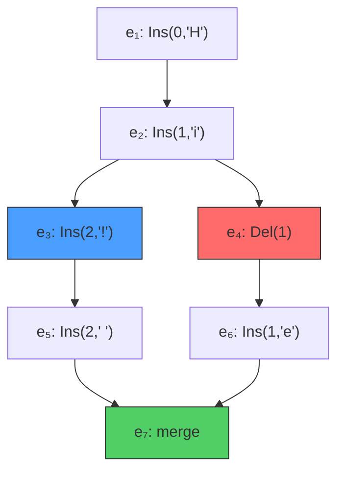

+++
title = "Eg-walker: Event Graph Walker"
description = "A collaboration algorithm for text editing that combines CRDT convergence with OT-competitive memory and merge performance."
weight = 1
tags = ["distributed-systems", "CRDTs", "operational-transformation", "visualization"]
latex = "\\text{doc} = \\text{replay}(G) \\quad \\text{where } G = (E, \\rightarrow)"
prerequisites = []
premier = true
+++

## Statement

The **eg-walker** algorithm (Gentle & Kleppmann, 2025) solves collaborative text editing in a peer-to-peer setting. Given an **event graph** $G = (E, \rightarrow)$ — a transitively-reduced DAG where each node is an insert or delete operation — the document state is defined as a deterministic function:

$$\text{doc} = \text{replay}(G)$$

**Convergence guarantee**: any two replicas that have processed the same set of events hold identical document states, regardless of the order in which events arrived.

The algorithm achieves:
- **CRDT-like decentralisation**: no central server required
- **OT-competitive performance**: order-of-magnitude less memory than traditional CRDTs
- **Efficient merging**: orders of magnitude faster than OT for long-diverged branches

## Visualization

The event graph captures the causal history of all edits:

Events $e_3$ and $e_4$ are **concurrent** ($e_3 \| e_4$): neither happened before the other. The eg-walker resolves their combined effect deterministically.

## The Event Graph

Each event $e$ consists of:

| Field | Description |
|-------|-------------|
| $\text{op}(e)$ | $\text{Insert}(i, c)$ or $\text{Delete}(i)$ — index-based operation |
| $\text{id}(e)$ | Unique pair $(\text{replica}, \text{seq})$ |
| $\text{parents}(e)$ | Set of IDs of causal predecessors |

The **happened-before** relation $e_1 \rightarrow e_2$ holds when there exists a directed path from $e_1$ to $e_2$. Events are **concurrent** when:

$$e_1 \| e_2 \iff e_1 \neq e_2 \;\wedge\; e_1 \not\rightarrow e_2 \;\wedge\; e_2 \not\rightarrow e_1$$

The **version** (frontier) of a graph $G$ is the set of events with no children:

$$\text{Version}(G) = \{e_1 \in G \mid \nexists\, e_2 \in G : e_1 \rightarrow e_2\}$$

## Core Insight

Traditional OT transforms each operation against a linear history. Traditional CRDTs maintain a full replica state with tombstones for every deleted character. Eg-walker's insight is:

> Process events in topological order, maintaining a lightweight internal state that can **retreat** (undo) and **advance** (redo) individual events to simulate each operation's original context — then emit a transformed operation for the current document.

The internal state captures the document at **two versions simultaneously**:
- **Prepare version** $V_p$: the context in which the next event was generated
- **Effect version** $V_e$: all events processed so far

## Complexity

| Operation | Cost |
|-----------|------|
| Merge two branches of $k$ and $m$ events | $O((k+m) \log(k+m))$ |
| Single apply/retreat/advance | $O(\log n)$ |
| Worst case for arbitrary graph with $n$ events | $O(n^2 \log n)$ |

## Connections

Eg-walker builds on [[Event Graph Convergence Proof]] for correctness. The [[Advance and Retreat Mechanism]] details how the internal state navigates the causal graph. The [[Internal State Machine]] formalises the per-character state transitions. Concurrent insert ordering uses list CRDT algorithms (RGA/YATA variants) to break ties deterministically.

## References

- Gentle, J. & Kleppmann, M. (2025). *Collaborative Text Editing with Eg-walker: Better, Faster, Smaller*. EuroSys 2025. [arXiv:2409.14252](https://arxiv.org/abs/2409.14252)
- Attiya, H. et al. (2016). *Specification and Complexity of Collaborative Text Editing*. PODC.
