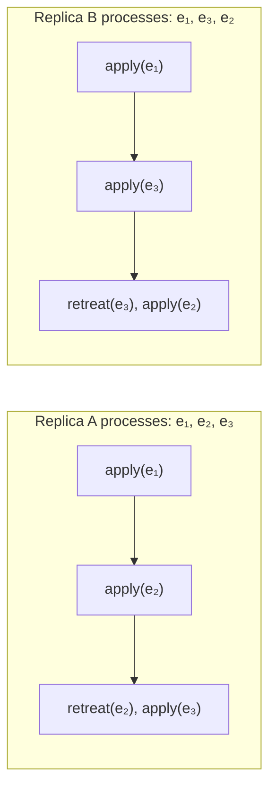

+++
title = "Event Graph Convergence Proof"
description = "Formal proof that eg-walker produces identical document states regardless of topological sort order — strong eventual consistency."
weight = 2
tags = ["distributed-systems", "convergence", "proof"]
latex = "\\forall \\sigma_1, \\sigma_2 \\in \\text{TopoSorts}(G): \\text{replay}(G, \\sigma_1) = \\text{replay}(G, \\sigma_2)"
prerequisites = ["eg-walker-overview"]
+++

## Statement

**Theorem (Convergence).** Let $G = (E, \rightarrow)$ be a valid event graph and let $\sigma_1, \sigma_2$ be any two topological sorts of $G$. Then:

$$\text{replay}(G, \sigma_1) = \text{replay}(G, \sigma_2)$$

That is, the document state produced by eg-walker is **independent of the processing order**, provided that order respects causality.

## Definitions

**Definition 1 (Event Graph).** An event graph $G = (E, \rightarrow)$ is a finite, transitively-reduced DAG where each node $e \in E$ carries an operation $\text{op}(e) \in \{\text{Insert}(i,c), \text{Delete}(i)\}$ and a unique identifier $\text{id}(e)$.

**Definition 2 (Version).** The version of $G$ is its frontier:

$$\text{Version}(G) = \{e \in G \mid \nexists\, e' \in G : e \rightarrow e'\}$$

**Definition 3 (Replay).** $\text{replay}(G)$ processes events in some topological sort order, using the advance/retreat mechanism to align the prepare version with each event's parents before applying it. The output is the final document string.

**Definition 4 (Strong Eventual Consistency).** A replicated system is strongly eventually consistent if:
1. **Convergence**: replicas that have delivered the same set of events are in the same state
2. **Eventual delivery**: every event generated at one correct replica is eventually delivered to all correct replicas

## Proof Structure

The proof proceeds by showing that swapping two adjacent concurrent events in a topological sort does not change the output.

### Lemma 1 (Adjacent Swap)

If $e_a \| e_b$ and $\sigma = (\ldots, e_a, e_b, \ldots)$ is a valid topological sort, then $\sigma' = (\ldots, e_b, e_a, \ldots)$ produces the same document state.

**Proof sketch.** Since $e_a \| e_b$, neither is an ancestor of the other. When processing $e_b$ after $e_a$ in $\sigma$:
- The retreat mechanism undoes $e_a$ from the prepare version (since $e_a \notin \text{Events}(e_b.\text{parents})$)
- The effect version includes both $e_a$ and $e_b$

When processing $e_a$ after $e_b$ in $\sigma'$:
- The retreat mechanism undoes $e_b$ from the prepare version
- The effect version again includes both $e_a$ and $e_b$

In both cases, the final effect version after processing both events is identical. The transformed operations emitted may differ, but their composition produces the same document. $\square$

### Lemma 2 (Topological Sort Reachability)

Any topological sort $\sigma_1$ can be transformed into any other topological sort $\sigma_2$ by a sequence of adjacent transpositions of concurrent events.

**Proof.** Standard result from partial order theory: two linear extensions of a partial order are connected by a sequence of adjacent transpositions of incomparable elements. $\square$

### Main Theorem

By Lemma 2, any two topological sorts are connected by adjacent swaps of concurrent events. By Lemma 1, each swap preserves the document state. By transitivity, all topological sorts produce the same document. $\square$

## Visualization

Two replicas processing the same three events in different orders:

Despite different orderings, both replicas arrive at the same document state because the effect version accumulates the same set of events $\{e_1, e_2, e_3\}$.

## The Strong List Specification

Eg-walker satisfies the **strong list specification** (Attiya et al., 2016), which requires:

1. **Insert-validity**: an inserted element appears in the list at the specified position relative to the inserter's observed state
2. **Delete-validity**: a deleted element was present at the specified position in the deleter's observed state
3. **Convergence**: all replicas observing the same events agree on list contents and order
4. **Non-interleaving**: concurrent sequences of insertions at the same position are not interleaved

$$\forall\, \text{replicas } r_1, r_2: \quad \text{Events}(r_1) = \text{Events}(r_2) \implies \text{doc}(r_1) = \text{doc}(r_2)$$

## Critical Versions

**Definition (Critical Version).** A version $V$ of graph $G$ is **critical** iff it partitions $G$ into $G_1 = \text{Events}(V)$ and $G_2 = G \setminus G_1$ such that:

$$\forall\, e_1 \in G_1,\; \forall\, e_2 \in G_2: \quad e_1 \rightarrow e_2$$

Critical versions act as barriers — events before and after can be processed independently. This enables:
- Discarding internal state up to critical versions
- Partial replay from the most recent critical version
- Garbage collection of tombstones

## Connections

The convergence result relies on the [[Advance and Retreat Mechanism]] correctly maintaining the two-version internal state. The [[Internal State Machine]] ensures that retreat/advance transitions are reversible. Concurrent insert ordering (via YATA/RGA) provides the deterministic tie-breaking needed for the non-interleaving property.

## References

- Gentle & Kleppmann (2025), Appendix C: Formal proof of convergence
- Attiya, H. et al. (2016). *Specification and Complexity of Collaborative Text Editing*. PODC.
