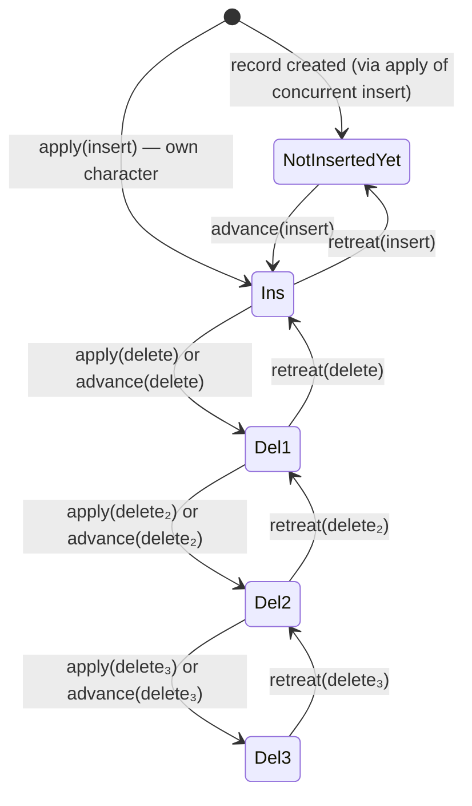

+++
title = "Internal State Machine"
description = "The per-character state machine that tracks insertion/deletion across prepare and effect versions in eg-walker."
weight = 4
tags = ["distributed-systems", "state-machines", "visualization"]
latex = "s_p \\in \\{\\text{NotInsertedYet}, \\text{Ins}, \\text{Del}_1, \\text{Del}_2, \\ldots\\}"
prerequisites = ["advance-retreat"]
+++

## Statement

Each character in the eg-walker internal state carries two independent state variables:

- **Prepare state** $s_p \in \{\text{NotInsertedYet}, \text{Ins}, \text{Del}_1, \text{Del}_2, \ldots\}$
- **Effect state** $s_e \in \{\text{Ins}, \text{Del}\}$

The prepare state tracks whether a character is visible in the **author's context** and handles concurrent deletions via a counter. The effect state tracks the character's status in the **cumulative document**.

## State Transition Diagram

The prepare state $s_p$ follows these transitions:



The effect state $s_e$ is simpler — it only moves forward:

$$s_e: \quad \text{Ins} \xrightarrow{\text{apply(delete)}} \text{Del}$$

## Formal Definitions

**Definition (Character Record).** A record $r$ in the internal state sequence is a tuple:

$$r = (\text{id}, s_p, s_e, \text{crdt\_metadata})$$

where $\text{id}$ is the unique ID of the inserting event.

**Invariant 1 (Effect monotonicity).** Once $s_e = \text{Del}$, it never returns to $\text{Ins}$.

**Invariant 2 (Version containment).** The prepare version is always a subset of the effect version:

$$\text{Events}(V_p) \subseteq \text{Events}(V_e)$$

**Invariant 3 (Del counter correctness).** $s_p = \text{Del}_n$ iff exactly $n$ delete events targeting this character are in the current prepare version.

## Transition Rules

| Event type | Operation | $s_p$ transition | $s_e$ transition |
|-----------|-----------|-----------------|-----------------|
| Insert | apply | $\emptyset \to \text{Ins}$ | $\emptyset \to \text{Ins}$ |
| Insert | retreat | $\text{Ins} \to \text{NotInsertedYet}$ | — |
| Insert | advance | $\text{NotInsertedYet} \to \text{Ins}$ | — |
| Delete | apply | $\text{Ins} \to \text{Del}_1$ or $\text{Del}_n \to \text{Del}_{n+1}$ | $\text{Ins} \to \text{Del}$ |
| Delete | retreat | $\text{Del}_1 \to \text{Ins}$ or $\text{Del}_n \to \text{Del}_{n-1}$ | — |
| Delete | advance | $\text{Ins} \to \text{Del}_1$ or $\text{Del}_n \to \text{Del}_{n+1}$ | — |

## Why the Del Counter?

When multiple users concurrently delete the same character, the prepare version must track **how many** of those deletions are currently "active":

$$\text{User A deletes } c \quad \| \quad \text{User B deletes } c$$

After processing both, $s_p = \text{Del}_2$. Retreating one deletion gives $\text{Del}_1$ (still deleted), not $\text{Ins}$. Only after retreating both does the character become visible again.

## Visualization: Worked Example

Three users concurrently edit the document "ab":

```
Initial: "ab"  (records: [a: Ins/Ins, b: Ins/Ins])

User 1: Delete(0) — deletes 'a'
User 2: Delete(0) — also deletes 'a'  (concurrent with User 1)
User 3: Insert(1, 'x') — inserts between 'a' and 'b'
```

Processing in order $e_1$ (User 1), $e_2$ (User 3), $e_3$ (User 2):

| Step | Action | Record 'a' ($s_p$/$s_e$) | Record 'x' ($s_p$/$s_e$) | Record 'b' ($s_p$/$s_e$) |
|------|--------|--------------------------|--------------------------|--------------------------|
| 0 | initial | Ins/Ins | — | Ins/Ins |
| 1 | apply($e_1$: Del 'a') | Del₁/Del | — | Ins/Ins |
| 2 | retreat($e_1$), apply($e_2$: Ins 'x') | Ins/Del | Ins/Ins | Ins/Ins |
| 3 | advance($e_1$), apply($e_3$: Del 'a') | Del₂/Del | Ins/Ins | Ins/Ins |

Final state: 'a' has $s_p = \text{Del}_2$, $s_e = \text{Del}$ — correctly deleted. The document is "xb".

## B-tree Index Structure

Records are stored in a balanced B-tree with augmented counts at each internal node:

$$\text{Node augmentation} = \begin{cases} \text{count}(s_p = \text{Ins}) & \text{for prepare-version indexing} \\ \text{count}(s_e = \text{Ins}) & \text{for effect-version indexing} \end{cases}$$

This enables $O(\log n)$ operations:
- **Find $i$-th visible character** in either version: descend the tree using augmented counts
- **Translate position** between versions: sum counts on the path from leaf to root
- **Update on retreat/advance**: update $O(\log n)$ ancestor counts

## Connections

The state machine is the foundation on which the [[Advance and Retreat Mechanism]] operates. Its invariants are essential for the [[Event Graph Convergence Proof]]. The B-tree structure gives eg-walker its $O(\log n)$ per-operation complexity, contributing to the performance advantages over traditional CRDTs described in [[Eg-walker: Event Graph Walker]].
